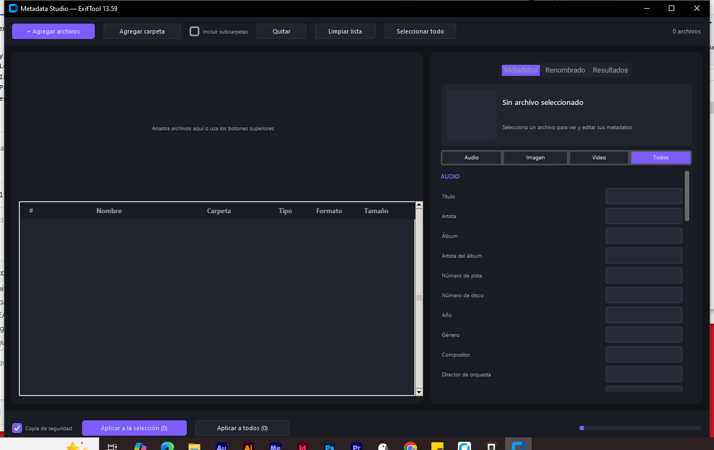
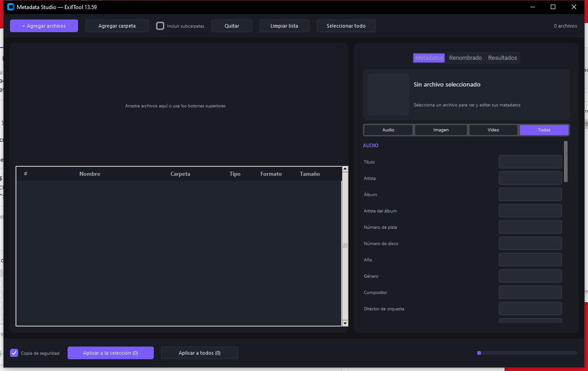
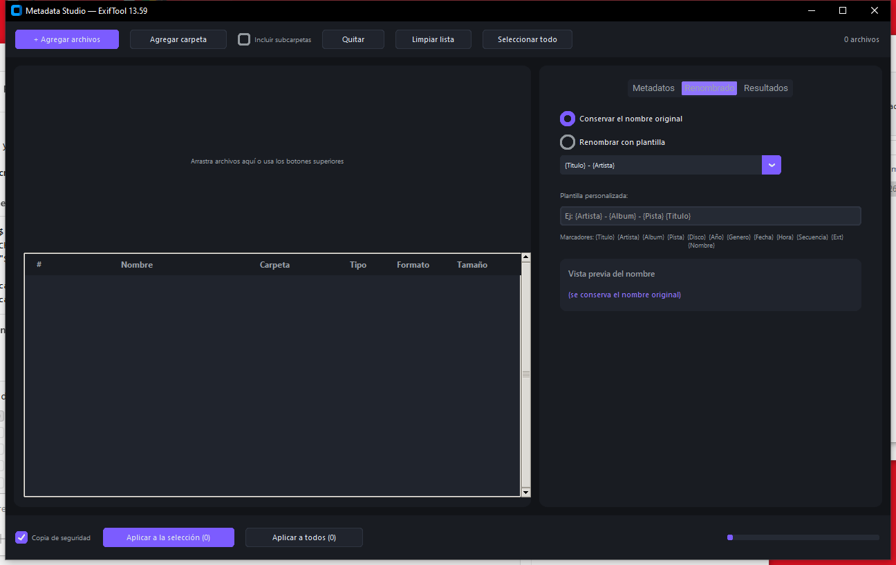
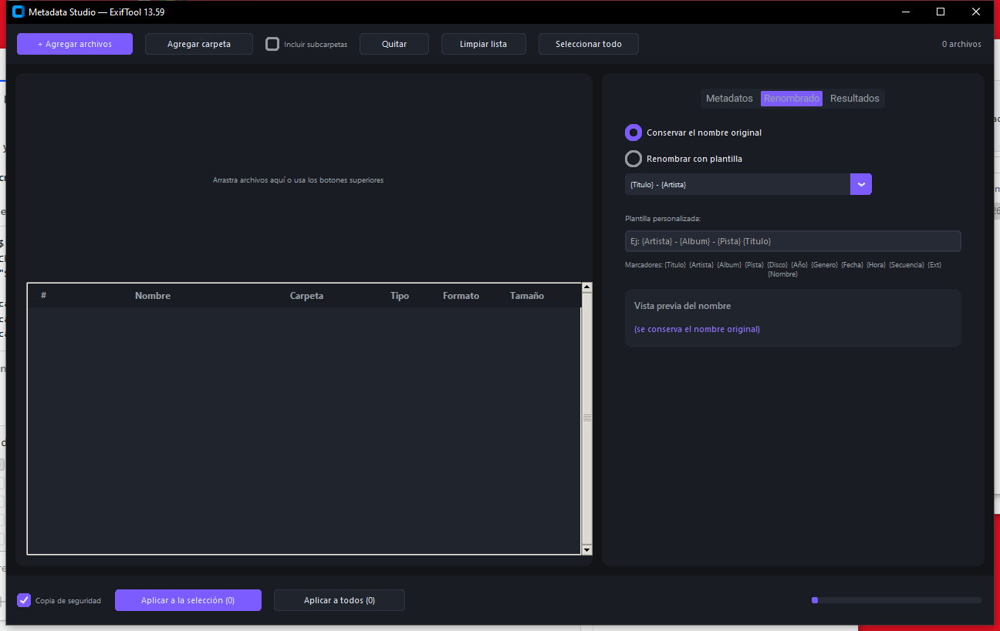

# Metadata Studio

Editor de metadatos por lotes para **audio, imagen y video** con interfaz oscura estilo estudio. Modifica toda la información de tus archivos multimedia de forma individual o masiva (1, 100 o miles de archivos a la vez), con opción de renombrado automático mediante plantillas y copias de seguridad previas.


---

## Capturas de pantalla

| | |
|---|---|
|  |  |
| **Inicio** | **Lista de archivos cargados** |
|  |  |
| **Editor de metadatos** | **Renombrado con plantillas** |



---

## Características

- **Arrastra y suelta** archivos a la ventana, o agrégalos con el botón o por carpeta (con subcarpetas opcionales)
- **Edición individual o por lotes**: selecciona uno o cientos de archivos y aplica los mismos cambios a todos
- **Campos dinámicos según el tipo**: muestra automáticamente los campos válidos para audio, imagen o video
- **Renombrado automático** con plantillas: `{Artista} - {Titulo}`, `{Fecha}_{Secuencia}`, etc., con vista previa en vivo
- **Copia de seguridad opcional** antes de escribir (se guarda en `Documentos\MetadataStudio Backups\`)
- **Barra de progreso y reporte** por archivo (éxitos, errores, renombrados)
- **Motor doble de escritura**: ExifTool para imágenes/video y Mutagen para audio (MP3, FLAC, OGG, OPUS, WAV, WMA, AAC, AIFF, APE)
- **Apertura por línea de comandos**: pasa rutas de archivos como argumentos para abrirlos directamente
- 100 % portable: un solo `.exe`, no requiere instalación ni dependencias externas

## Requisitos

| | |
|---|---|
| Sistema operativo | Windows 10 u 11 (64 bits) |
| RAM | 500 MB o más |
| Espacio en disco | ~100 MB |
| Instalación | **Ninguna** (archivo portable) |

## Instalación (modo portable)

### Opción A — Usar el EXE ya compilado (recomendada)

1. Descarga `MetadataStudio.exe` desde la sección **Releases** de este repositorio
2. Copia el archivo a cualquier carpeta (puede ser un USB o una carpeta de Dropbox/OneDrive)
3. Haz **doble clic** sobre `MetadataStudio.exe`
4. Si Windows SmartScreen muestra un aviso: pulsa **"Más información" → "Ejecutar de todas formas"** (es un falso positivo habitual de los ejecutables generados con PyInstaller; si tu antivirus lo bloquea, agrégalo a la lista de exclusiones)

No se necesita Python ni ningún otro programa instalado.

### Opción B — Ejecutar desde el código fuente

1. Instala [Python 3.12](https://www.python.org/downloads/) marcando **"Add python.exe to PATH"**
2. Clona o descarga este repositorio
3. Doble clic en **`INSTALAR.bat`** (crea el entorno virtual e instala las dependencias, solo la primera vez)
4. Doble clic en **`INICIAR.bat`** cada vez que quieras abrir el programa

### Opción C — Compilar tu propio EXE

1. Completa la Opción B (pasos 1 a 3)
2. Doble clic en **`COMPILAR.bat`**
3. El ejecutable se genera en `dist\MetadataStudio.exe` (un solo archivo, listo para copiar donde quieras)

## Guía de uso

### 1. Cargar archivos

- Botón **"+ Agregar archivos"**, **"Agregar carpeta"** (marca "Incluir subcarpetas" si es necesario), o simplemente **arrastra y suelta** los archivos sobre la ventana
- También puedes abrir archivos directo desde la terminal:

```cmd
MetadataStudio.exe "C:\musica\cancion.mp3" "C:\fotos\paisaje.jpg"
```

### 2. Editar metadatos

1. **Un archivo**: haz clic en su fila → el panel derecho muestra sus valores actuales en gris ("Actual: ...")
2. **Varios archivos**: selección con `Ctrl + clic` o el botón "Seleccionar todo" → lo que escribas se aplicará a todos
3. Elige la categoría: **Audio / Imagen / Video / Todos**
4. Rellena **solo los campos que quieras cambiar**; los vacíos no se tocan
5. Pulsa **"Aplicar a la selección (N)"** o **"Aplicar a todos"**

### 3. Renombrar (opcional)

1. Ve a la pestaña **"Renombrado"**
2. Elige **"Conservar el nombre original"** o **"Renombrar con plantilla"**
3. Usa una plantilla predefinida o escribe la tuya con los marcadores:

| Marcador | Valor |
|---|---|
| `{Titulo}` `{Artista}` `{Album}` `{Genero}` | Tags de audio |
| `{Pista}` `{Disco}` `{Año}` | Números |
| `{Fecha}` `{Hora}` | Fecha/hora de captura (imagen o audio) |
| `{Secuencia}` | Contador automático 001, 002... |
| `{Nombre}` `{Ext}` | Nombre original / extensión |

Ejemplo: `{Artista} - {Album} - {Pista} {Titulo}` → `Queen - Greatest Hits - 03 We Are The Champions.mp3`

### 4. Revisar resultados

- La barra inferior muestra el progreso (`34/100`)
- La pestaña **"Resultados"** lista cada archivo procesado: `[OK]` con su nuevo nombre si fue renombrado, o `[ERR]` con el motivo
- Las copias de seguridad quedan en `Documentos\MetadataStudio Backups\AAAA-MM-DD_HHMMSS\`

## Formatos soportados

### Escritura de metadatos

| Tipo | Formatos | Motor |
|---|---|---|
| Imagen | JPG/JPEG, PNG, WEBP, TIFF, GIF, BMP, HEIC | ExifTool (EXIF, IPTC, XMP) |
| Audio | MP3, FLAC, OGG, OPUS, WAV, AIFF, AAC, WMA, APE, MPC, WV | Mutagen (ID3, Vorbis, APEv2, ASF) |
| Audio | M4A, M4B | ExifTool (QuickTime) |
| Video | MP4, MOV, M4V | ExifTool (QuickTime) |

### Solo lectura (avisan con error al intentar escribir)

- Video: MKV, AVI, WMV, WEBM, FLV, MPEG (el formato no expone tags editables)
- Cualquier archivo con protección o formato no reconocido

## Campos editables

- **Audio**: Título, Artista, Álbum, Artista del álbum, Pista, Disco, Año, Género, Compositor, Director de orquesta, Editor/Discográfica, Codificado por, Comentario, Copyright, Letras, BPM
- **Imagen**: Título, Descripción, Autor, Copyright, Palabras clave, Calificación (0-5), Cámara, Lente, ISO, Apertura, Exposición, Distancia focal, Fecha de captura, GPS (lat/lon/alt), Ciudad, Estado, País, Software
- **Video**: Título, Descripción, Director, Productor, Guionista, Actores, Show, Temporada, Episodio, Género, Año, Copyright, Comentario

## Solución de problemas

| Problema | Solución |
|---|---|
| Windows bloquea el EXE (SmartScreen) | "Más información" → "Ejecutar de todas formas" |
| El antivirus elimina o bloquea el EXE | Agrega `MetadataStudio.exe` a exclusiones (falso positivo de PyInstaller) |
| Error inesperado en la interfaz | Revisa `error.log` junto al EXE (se genera automáticamente) |
| Un formato no guarda los cambios | Consulta la tabla de formatos: algunos son de solo lectura |
| El programa tarda en abrir (10-20 s la primera vez) | Normal: descomprime el contenido en memoria; las siguientes veces es más rápido |

## Estructura del proyecto

```
├── app.py                  # Punto de entrada
├── core/
│   ├── metadata.py         # Motor ExifTool + escritor de audio Mutagen, campos y formatos
│   ├── renamer.py          # Plantillas de renombrado
│   └── batch.py            # Procesador por lotes en segundo plano
├── gui/
│   ├── theme.py            # Tema oscuro y estilos
│   └── main_window.py      # Interfaz completa (CTk + drag & drop)
├── exiftool/               # ExifTool 13.59 embebido (requerido para compilar)
├── docs/screenshots/       # Capturas para la documentación
├── INSTALAR.bat            # Configura el entorno de desarrollo
├── INICIAR.bat             # Ejecuta desde el código fuente
├── COMPILAR.bat            # Genera dist\MetadataStudio.exe
└── requirements.txt        # Dependencias de Python
```

## Tecnologías

- [Python 3.12](https://www.python.org/) · [CustomTkinter](https://customtkinter.tomschimansky.com/) (interfaz)
- [ExifTool 13.59](https://exiftool.org/) de Phil Harvey (metadatos de imagen/video)
- [Mutagen](https://mutagen.readthedocs.io/) (tags de audio)
- [TkinterDnD2](https://github.com/pmgagne/tkinterdnd2) (arrastrar y soltar)
- [PyInstaller](https://pyinstaller.org/) (empaquetado en un solo EXE)

## Licencias

- Este proyecto: código abierto, uso libre para fines personales y comerciales
- ExifTool: licencia [Artistic/GPL](exiftool/exiftool_files/LICENSE) — © Phil Harvey
- Las demás bibliotecas conservan sus propias licencias de código abierto
